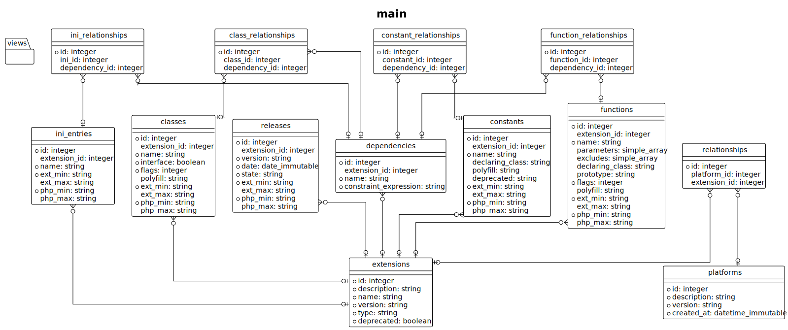

<!-- markdownlint-disable MD013 -->
# Architecture

This guide is dedicated to all PHP developers that want to learn more about each component.

As application is following the [Domain-driven design][ddd-archi] (DDD) principle, the directory structure match this one.

```text
src/
├── Application
├── Domain
├── Infrastructure
└── Presentation
```

## Entity Relationship diagram

Here is the database [ER model][er-model] that will contain all data you may find it into `data/reference/` directory.



## Command Line Runner

`CompatInfoDB` is a Symfony Console Application with many Command.

### Presentation layer


### Application layer


## Configuration

The `ConfigResolver` component is in charge to handle all arguments/options provided by an instance of `Symfony\Component\Console\Input\InputInterface`

You will find usage into the `Bartlett\CompatInfoDb\Application\Kernel\ConsoleKernel::createFromInput` function.


## Kernel

This element is the main entry point of the `bin/compatinfo-db` command line runner.


## Events

`CompatInfoDB` use the [Symfony Event-Dispatcher][sf-event-dispatcher] component to avoid tight coupling
between a set of interacting objects.

For example, the `Bartlett\CompatInfoDb\Application\Event\Subscriber\ProfileEventSubscriber` allows to print
the consume summary results only on demand (with command line runner `--profile` option).


[ddd-archi]: https://en.wikipedia.org/wiki/Domain-driven_design
[er-model]: https://en.wikipedia.org/wiki/Entity%E2%80%93relationship_model
[sf-event-dispatcher]: https://symfony.com/doc/current/components/event_dispatcher.html
